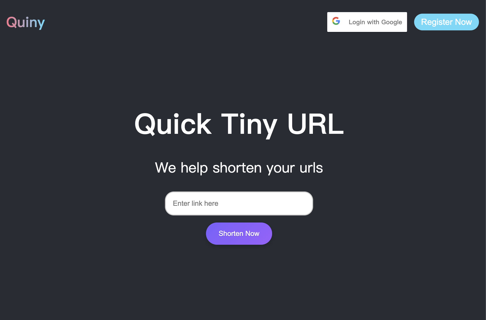
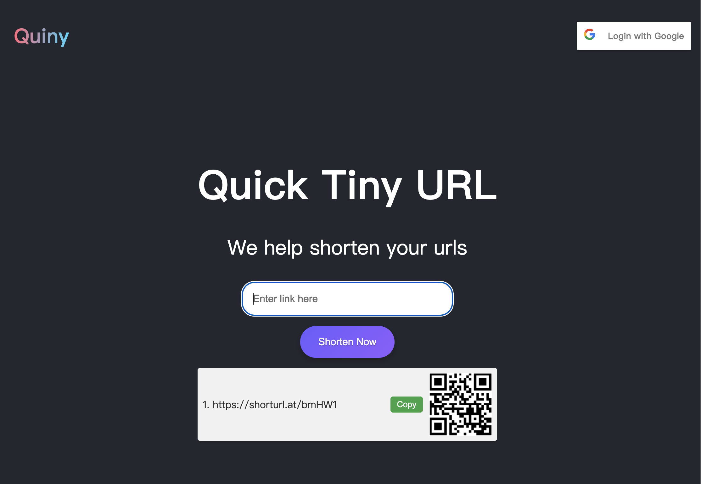

# Quiny Shortener

This project is for COMP 539

Before you use this project, please do `npm install` at first to download\
required packages.

### Frontend Preview

After shorten a origin link

### `npm start`

Runs the app in the development mode.\
Open [http://localhost:3000](http://localhost:3000) to view it in your browser.

### `npm run build`

Builds the app for production to the `build` folder.\

The build is minified and the filenames include the hashes.\
Your app is ready to be deployed!
